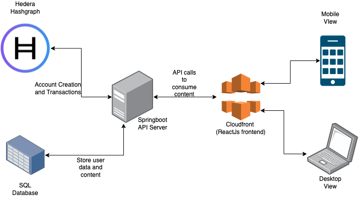

<h1 align="center">
    STREAMIFY
</h1>
<h3 align="center"> The backend server implementation for Streamify</h3>
<h5 align="center">This is a old mirror of the project built for the Hedera Hackathon</h5>

<!--Image here of product-->

<h2 id="table-of-contents">:book: Table of Contents</h2>

    
Table of Contents

    <ol> 
        <li> <a href="#about">➤ About the Project</a> </li>
        <li> <a href="#overview">➤ Overview</a> </li>
        <li> <a href="#stories">➤ User Stories</a> </li>
        <li> <a href="#architecture">➤ Architecture</a> </li>
        <li> <a href="#screenshots">➤ Screenshots</a> </li>
        <li> <a href="#reference">➤ References</a> </li>
    </ol>

======

<h2 id="about">:pencil: About the Project</h2>

    Hedera Hashgraph is a distributed ledger technology that is designed for fast, fair and secure application that take advantage of the efficiency of hashgraph. This is an application proof-of-concept built on the Hedera Hashgraph, leveraging it to promote easy content streaming.

======

<h2 id="overview">:cloud: Overview</h2>

    With any form of media right now, streaming has been the most commonly used form to enjoy it. From streaming music on Spotify to watching streams on Twitch. With a general subscription-based model, users pay on a monthly or yearly basis.

    When you have a well-established application, this makes sense to have such a model but what about users in a niche market looking to stream a specific type of content? They don't really need access to all the other extra content they get in a subscription.

    With the speed of transactions on the Hedera network, we propose a system that allows products to hit the market of users who are not ready to pay for a monthly subscription by allowing them to pay for the content they stream/use, thus allowing these services/products to reach a hesitant potential user base they couldn't have acquired before.

    Our platform("Streamify") will allow users, companies, etc to stream any form of content and pay for the amount of content they have streamed via Hbars.

======

<h2 id="stories">:ledger: User Stories</h2>

    The features determined for the implementation of the PoC to demonstrate the capability of the application in context of utilizing the Hedera Hashgraph are as follows:

    As a user I should be able to:
    <ol>
        <li>Create an account on the platform</li>
        <li>Create a hedera wallet associated with their account</li>
        <li>Stream audio content</li>
        <li>Stream text content via ebooks</li>
        <li>Pay for the content streamed using Hbars</li>
    </ol>

======

<h2 id="architecture">:shinto_shrine: Architecture</h2>

    The core architecture revolves around streaming content easily to the user and making sure that the transactions are fast enough to keep the user experience seamless. 

    The transaction aspect being handled by the Hashgraph ensures that when the user will not experience any hiccups from that front. This leaves only content streaming aspect and hedera account management to the application.

    

    The core technology stack can be broken down as follows:
    <ol>
        <li>Backend</li>
        <li>Frontend</li>
    </ol>

    Backend
    <ol>
        <li>Java </li>
        <li>Springboot (HTTP API)</li>
        <li>Hedera Hashgraph</li>
        <li>MySQL Database</li>
    </ol>

    Frontend
    <ol>
        <li>ReactJs</li>
        <li>Bootstrap v4</li>
        <li>Distributed via Cloudfront(initially wanted to give live link)</li>
    </ol>

    
Why use Java - Springboot for streaming?

    

        Springboot is built on the Spring framework that offers support for asynchronous request processing via `StreamingResponseBody`. This enables applications to write data directly to the response OutpuStream without holding up a thread. Therefore Springboot is well equipped to handle streaming scenarios that might be required.
    

        
Why use MySQL when building a decentralized application?

        

            In order to quickly prototype the application for the Hackathon, we decided to use MySQL as it is a very stable and mature database implementation. The core implementation of the database will remain the same, we can swap it for a decentralized solution[Checkout OurSQL](https://github.com/gelembjuk/oursql). Or when there are stable implemenations of a decentralized database, we can switch to that.
        

    

    

        
Why is this repo out of sync with the main implementation?

        

            We take this Hackathon seriously. Our USP of the app is the ability to stream content and have seamless transactions via Hedera. To avoid other participants ripping the code, this is kept out-of-sync with the main repo. Will be updated after the competition.
        

    

======

<h2 id="overview">:floppy_disk: Screenshots</h2>

    
    Shows wallet section of the App.

    
    Viewing the different types of content that can be streamed

======

<h2 id="overview">:keyboard: References</h2>

    <ul>
        <li></li>
    </ul>

We are looking to make this the top app built on the Hedera platform. We want to expand the tech by implementing the following:
<ol>
    <li>Using smart contracts to handle payments to send the app a percentage and the content creator the rest of the amount</li>
    <li>Improve UI and support native applications</li>
</ol>
